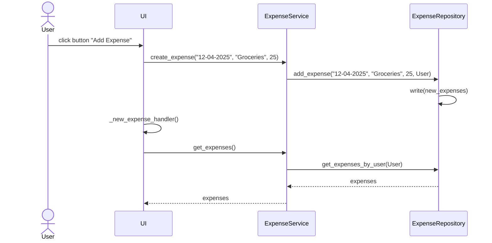

Uuden kulun luovan "Add Expense" painikkeen klikkaamisen seurauksena tapahtuva sovelluksen toimintalogiikka sekvenssikaaviona:

```mermaid
sequenceDiagram
    actor User
    User->>UI:click button "Add Expense"
    UI->> ExpenseService: create_expense("12-04-2025", "Groceries", 25)
    ExpenseService->>ExpenseRepository: add_expense("12-04-2025", "Groceries", 25, User)
    ExpenseRepository->>ExpenseRepository: write(new_expenses)

    UI->> UI: _new_expense_handler()
    UI->> ExpenseService: get_expenses()
    ExpenseService->>ExpenseRepository: get_expenses_by_user(User)
    ExpenseRepository -->> ExpenseService: expenses
    ExpenseService -->> UI: expenses
```
