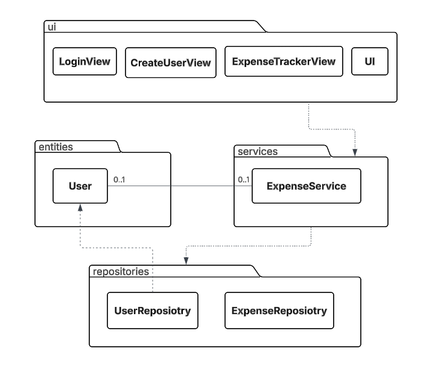
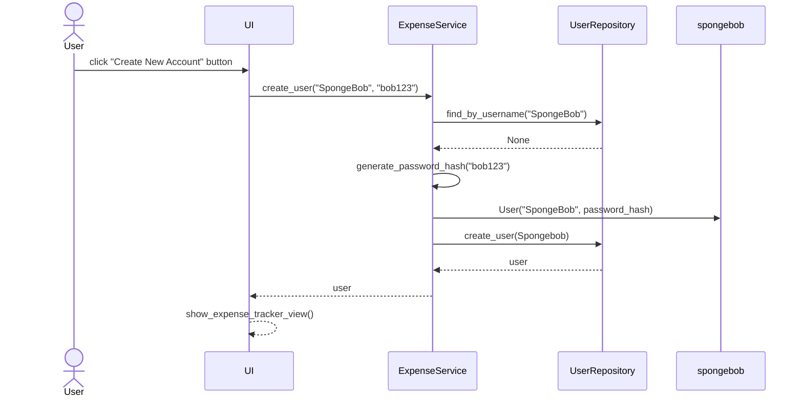
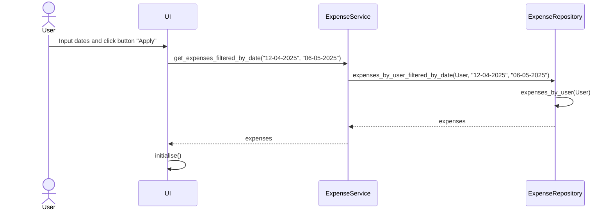

# Arkkitehtuurikuvaus

Sovellus koostuu käyttöliittymästä (ui), sovelluslogiikasta (services) ja tiedon pysyväistallennuksesta (repositories) huolehtivista luokista.

Ohjelman osien suhdetta kuvaava luokka/pakkauskaavio:



## Sovelluslogiikka

Sovelluksen tominnasta vastaa [ExpenseService](https://github.com/n1k1k/ot-harjoitustyo-2025/blob/main/src/services/expense_service.py) luokan olio. 
Luokka tarjoaa käyttöliittymälle seuraavat metodit:

- `login(username, password)`
- `logout()`
- `get_current_user()`
- `get_expenses()`
- `create_user(username, password)`
- `create_expense(date, category, amount)`
- `delete_expense(date, category, amount)`

ExpenseService käyttää kulujen ja käyttäjien tietojen tallennukseen [ExpenseRepository](https://github.com/n1k1k/ot-harjoitustyo-2025/blob/main/src/repositories/expense_repository.py) ja [UserReposiotory](https://github.com/n1k1k/ot-harjoitustyo-2025/blob/main/src/repositories/user_repository.py) luokkia. Näiden luokkien oliot injektoidaan ExpenseService-luokalle konstruktorikutsun yhteydessä.

## Käyttöliittymä

Sovelluksen käyttöliittymä koostuu kolmesta eri näkymästä:

- Sisäänkirjautuminen
- Uuden käyttäjä luominen
- Päänäkymä, jossa on listattu käyttäjän kulutu.
    - Päänäkymäässä on myös uusien kulujen lisäämiseen ja muokkaamiseen käytettävät ikkunat.

Yllä mainitut näkymät ovat toteutettu omina luokkinaan. Uusien kulujen lisäämiseen ja muokkaamiseen käytettävät ikkunat on toteutettu päänäkymän metodeina. Näkymien näyttämisestä ja sulkemisesta vastaa UI-luokka.

## Tiedon pysyväistallennus

Tietojen tallennuksesta vastaavat `UserRepository` ja `ExpenseRepository` luokat. `UserRepository` tallentaa käyttäjien tunnukset oletuksena database nimiseen SQLite-tietokantaan `users` nimiseen tauluun. `ExpenseRepository` tallentaa kulut oletuksena expenses.csv nimiseen CSV-tiedostoon. Kulut on tallennettu tiedostoon seuraavassa muodossa:

```
2025-04-28,Transportation,2.9,Matti
2025-04-25,Groceries,34.6,Matti
```
Eli päivämäärä, kategoria, rahamäärä ja käyttäjän käyttäjänimi eroteltuna pilkulla (,).

Tallennukseen käytettävien tiedostojen nimet on konfiguroitu .env tiedostoon seuraavasti:
```
DATABASE_FILENAME=database.sqlite
EXPENSES_FILENAME=expenses.csv
```

<br /> 

## Sovelluksen päätoiminnallisuudet

### Uuden käyttäjän luominen ja sisäänkirjautuminen

Sovelluksen kontrolli etenee seuraavasti, kun uuden käyttäjän luomisnäkymässä on syötetty uniikki käyttäjätunnus ja salasana ja painettu painiketta “Ceate New Account”:


Käyttöliittymä kutsuu `ExpenseService` luokan metodia [create_user](https://github.com/n1k1k/ot-harjoitustyo-2025/blob/d66631ca53ce37b94549ab3b1a4915934b62772e/src/repositories/user_repository.py#L20) `ExpenseService` tarkistaa ensin, onko käyttäjänimi jo käytössä, kutsumalla `UserReposetory` luokan metodia [find_by_username](https://github.com/n1k1k/ot-harjoitustyo-2025/blob/d66631ca53ce37b94549ab3b1a4915934b62772e/src/repositories/user_repository.py#L42) `UserRepository` palauttaa `None`, eli käyttäjätunnus on vapaa.  `ExpenseService` luo uuden käyttäjäolion joka sisältää annetun käyttäjänimen ja salatun salasanan. Salasan salataan [Werkzeug](https://pypi.org/project/Werkzeug/) kirjaston metodilla `generate_password_hash`. 
Tämän jälkeen `ExpenseService` lisää käyttäjän tietokantaan käyttäen `UserRepository` luokan metodia 
[create_user](https://github.com/n1k1k/ot-harjoitustyo-2025/blob/d66631ca53ce37b94549ab3b1a4915934b62772e/src/repositories/user_repository.py#L20), jolle annetaan parametriksi äsken luotu käyttäjäolio. `UserRepository` palauttaa tallennetun käyttäjän takaisin ExpenseService-palvelulle. Lopuksi  `ExpenseService` palauttaa käyttäjäolion käyttöliittymälle (UI), joka voi siirtyä seuraavaan näkymään. Lopuksi käyttöliittymä vaihtaa näkymän sovelluksen päänäkymään.

<br /> 

Sovelluksen kontrolli etenee seuraavasti kun kirjautusmisnäkymässä on syötetty olemassaoleva käyttäjätunnus ja salasana ja paneettu painiketta “Login”:

```mermaid
sequenceDiagram
  actor User
  participant UI
  participant ExpenseService
  participant UserRepository
  User->>UI: click "Login" button
  UI->>ExpenseService: login("SpongeBob", "bob123")
  ExpenseService->>UserRepository: find_by_username("SpongeBob")
  UserRepository-->>ExpenseService: user
  ExpenseService->>ExpenseService: check_password_hash(user.password, "bob123")
  ExpenseService-->>UI: user
  UI->>UI: show_expense_tracker_view()
  ```
Käyttöliittymä kutsuu  `ExpenseService` luokan metodia [login](https://github.com/n1k1k/ot-harjoitustyo-2025/blob/d66631ca53ce37b94549ab3b1a4915934b62772e/src/services/expense_service.py#L150). `ExpenseService` kysyy käyttäjätietoja  `UserRepository` luokalta kutsumalla metodia [find_by_username](https://github.com/n1k1k/ot-harjoitustyo-2025/blob/d66631ca53ce37b94549ab3b1a4915934b62772e/src/repositories/user_repository.py#L42). `UserRepository` repositorio palauttaa käyttäjäolion takaisin `ExpenseService` luokalle, jonka jälkeen `ExpenseService` tarkistaa vastaako käyttäjän antama salasana `UserRepository`:ta saatua salattua salasanaa. Tämä tapahtuu [Werkzeug](https://pypi.org/project/Werkzeug/) kirjaston metodilla `check_password_hash`. Tämän jälkeen `ExpenseService` palauttaa käyttäjäolion käyttöliittymälle. Lopuksi käyttöliittymä vaihtaa näkymän sovelluksen päänäkymään.

<br /> 

### Uuden kulun luominen

Uuden kulun luovan "Add Expense" painikkeen klikkaamisen seurauksena tapahtuva sovelluksen toimintalogiikka sekvenssikaaviona:

```mermaid
sequenceDiagram
    actor User
    User->>UI:click button "Add Expense"
    UI->> ExpenseService: create_expense("12-04-2025", "Groceries", 25)
    ExpenseService->>ExpenseRepository: add_expense("12-04-2025", "Groceries", 25, User)
    ExpenseRepository->>ExpenseRepository: write(new_expenses)

    UI->> UI: _new_expense_handler()
    UI->> ExpenseService: get_expenses()
    ExpenseService->>ExpenseRepository: get_expenses_by_user(User)
    ExpenseRepository -->> ExpenseService: expenses
    ExpenseService -->> UI: expenses
    UI ->> UI: change_expense_records()
```
<br /> 

Käyttöliittymä kutsuu `ExpenseService` luokan metodia [create_expense](https://github.com/n1k1k/ot-harjoitustyo-2025/blob/d66631ca53ce37b94549ab3b1a4915934b62772e/src/services/expense_service.py#L114). Parametreina annetaan kulun päivämäärä, kategoria ja summa. `ExpenseService` kutsuu `ExpenseRepository` luokan metodia  [add_expense]() joka huolehtii kulun tallentamisesta. Käyttöliittymä pyytää tämän jälkeen kaikki kulut, mukaanlukien äsken luotu uusi kulu, `ExpenseService` luokalta. `ExpenseService` välittää pyynnön `ExpenseRepository` luokalle, joka antaa kulut `ExpenseService` luokalle, joka puolestaa välittää ne käyttöliittymälle. Lopuksi käyttöliittymä päivittää näkymän.

### Kulujen suodattaminen päivämäärän perusteella

"From" ja "To" kenttiin päivämäärien syöttämisen ja "Apply" painikkeen likkaamisen seurauksena tapahtuva sovelluksen toimintalogiikka sekvenssikaaviona:



Käyttöliittymä kutsuu `ExpenseService` luokan metodia [get_expenses_filtered_by_date](). `ExpenseService` luokka pyytää suodatetu kulut `ExpenseRepository` luokalta. ExpenseRepository hakee ensin `ExpenseService` luokan antaman käyttäjän kulut ja sen jälkeen suodattaa ne annettujen päivämäärien perusteella. `ExpenseRepository` palauttaa suodatetu kulut `ExpenseService` luokalle, joka välittä ne käyttöliittymälle. Lopuksi käyttöliittymä päivittää näkymän.


