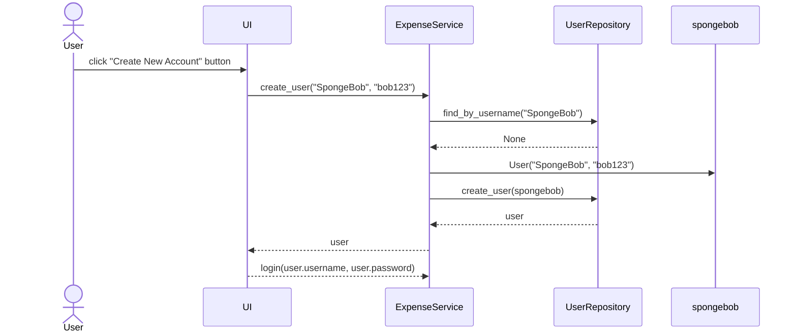

# Arkkitehtuurikuvaus

Sovellus koostuu käyttöliittymästä (ui), sovelluslogiikasta (services) ja tiedon pysyväistallennuksesta (repositories) huolehtivista luokista.

Ohjelman osien suhdetta kuvaava luokka/pakkauskaavio:


## Sovelluslogiikka

Sovelluksen tominnasta vastaa ExpenseService luokan olio. 
Luokka tarjoaa käyttöliittymälle seuraavat metodit:

- `login(username, password)`
- `logout()`
- `get_current_user()`
- `get_expenses()`
- `create_user(username, password)`
- `create_expense(date, category, amount)`
- `delete_expense(date, category, amount)`

ExpenseService käyttää kulujen ja käyttäjien tietojen tallennukseen ExpenseRepository ja UserReposiotory luokkia. Näiden luokkien oliot injektoidaan ExpenseService-luokalle konstruktorikutsun yhteydessä.

## Käyttöliittymä

Sovelluksen käyttöliittymä koostuu kolmesta eri näkymästä:

- Sisäänkirjautuminen
- Uuden käyttäjä luominen
- Päänäkymä, jossa on listattu käyttäjän kulutu.
    - Päänäkymäässä on myös uusien kulujen lisäämiseen ja muokkaamiseen käytettävät ikkunat.

Yllä mainitut näkymät ovat toteutettu omina luokkinaan. Uusien kulujen lisäämiseen ja muokkaamiseen käytettävät ikkunat on toteutettu päänäkymän metodeina. Näkymien näyttämisestä ja sulkemisesta vastaa UI-luokka.

## Tiedon pysyväistallennus

Tietojen tallennuksesta vastaavat UserRepository ja ExpenseRepository luokat. UserRepository tallentaa käyttäjien tunnukset oletuksena database nimiseen SQLite-tietokantaan users nimiseen tauluun. ExpenseRepository tallentaa kulut oletuksena expenses.csv nimiseen CSV-tiedostoon. Kulut on tallennettu tiedostoon seuraavassa muodossa:

```
2025-04-28,Transportation,2.9,Matti
2025-04-25,Groceries,34.6,Matti
```
Eli päivämäärä, kategoria, rahamäärä ja käyttäjän käyttäjänimi eroteltuna pilkulla (,).

<br /> 

## Sovelluksen päätoiminnallisuudet

### Uuden käyttäjän luominen ja sisäänkirjautuminen

Sovelluksen kontrolli etenee seuraavasti, kun uuden käyttäjän luomisnäkymässä on syötetty uniikki käyttäjätunnus ja salasana ja painettu painiketta “Ceate New Account”:



<br /> 

Sovelluksen kontrolli etenee seuraavasti kun kirjautusmisnäkymässä on syötetty olemassaoleva käyttäjätunnus ja salasana ja paneettu painiketta “Login”:

```mermaid
sequenceDiagram
  actor User
  participant UI
  participant ExpenseService
  participant UserRepository
  User->>UI: click "Login" button
  UI->>ExpenseService: login("SpongeBob", "bob123")
  ExpenseService->>UserRepository: find_by_username("SpongeBob")
  UserRepository-->>ExpenseService: user
  ExpenseService-->>UI: user
  UI->UI: show_expense_tracker_view()
  ```

<br /> 

### Uuden kulun luominen

Uuden kulun luovan "Add Expense" painikkeen klikkaamisen seurauksena tapahtuva sovelluksen toimintalogiikka sekvenssikaaviona:

```mermaid
sequenceDiagram
    actor User
    User->>UI:click button "Add Expense"
    UI->> ExpenseService: create_expense("12-04-2025", "Groceries", 25)
    ExpenseService->>ExpenseRepository: add_expense("12-04-2025", "Groceries", 25, User)
    ExpenseRepository->>ExpenseRepository: write(new_expenses)

    UI->> UI: _new_expense_handler()
    UI->> ExpenseService: get_expenses()
    ExpenseService->>ExpenseRepository: get_expenses_by_user(User)
    ExpenseRepository -->> ExpenseService: expenses
    ExpenseService -->> UI: expenses
```
