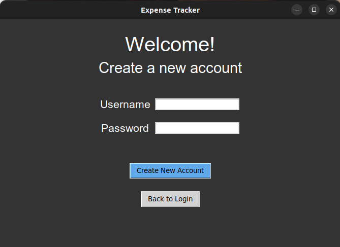
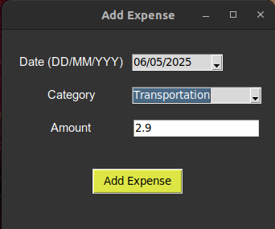

# Käyttöohje

## Konfigurointi

Sovellus luo automaattisesti talennukseen käytettävät tiedostot data-hakemistoon. Tiedostojen nimiä voi halutessaan muttaa muokkaamalla käynnistyshakemistossa olevaa .env tiedostoa. Tiedoston muodon tulee olla seuraava:
```
DATABASE_FILENAME= <tiedoston nimi>.sqlite
EXPENSES_FILENAME= <tiedoston nimi>.csv
```

## Sovelluksen käynnistys
Ennen kuin sovelluksen käynnistää ensimmäisen kerran tulee asentaa sovelluksen riippuvuudet komennolla:
```
poetry install
```

Sen jälkeen suorita tarvittavat alustustoimenpiteet komennolla:
```
poetry run invoke build
```

Ohjelman voi tämän jälkeen käynnistää komennolla:
```
poetry run invoke start
```

## Sovelluksen käyttäminen

### Sisäänkirjautuminen
Sovellus avaa käynnistämisen jälkeen sisäänkirjautumisnäkymän. sovellukseen voi kirjautua antamalla olemassaolevan käyttäjänimen ja salasanan ja painamalla “Login” painiketta.


Jos kirjautuminen onnistuu, sovellus siirtyy pääsivulle, jossa on listattu käyttäjän kulut.

### Uuden käyttäjän luominen

Uuden käyttäjän pääsee luomaan kirjautusminäkymässä olevaal “Create New Account” painiketta. Silloin sovellus siirtyy uuden käyttäjän luomisnäkymään jossa uuden käyttäjän voi luoda antamalla käyttäjänimen ja salasanan ja painamalla “Create New Account” painiketta. Käyttäjänimen tulee olla uniikki. Lisäksi sen ja salasanan tulee olla vähintään 3 merkkiä pitkiä.

Jos ei haluakkaan luoda uutta käyttäjää, sisäänkirjautumisnäkymään voi palata “Back to Login” painikkeella.



Jos uuden käyttäjän luominen onnistuu, sovellus kirjaa käyttäjä sisään ja siirtyy pääsivulle, jossa on listattu käyttäjän kulut.

### Kulun luominen

Sovelluksen päänäkymä, jossa näkyy käyttäjän kulut taulukossa on aluksi tyhjä ja näyttää seuraavalta:


Kuluja voi lisätä painamalla vihreää “Add Expense” painiketta. Tällöin sovellus avaa uuden ikkunan, jossa kuluja voi lisätä valitsemalla päivämäärän ja kategorian ja syöttämällä kulun määrän.



Kulun päivämäärän oletusarvo on nykyinne päivämäärä ja se tulee antaa muodossa DD/MM/YYYY. Kulun määrän tulee olla numero ja desimaalierottimena käytetään pilkkua. 

Kulu lisätään painamalla “Add Expense” painiketta. Tällöin kulu ilmestyy listausnäkymään:


### Kulujen poistaminen ja muokkaaminen

Jos kulua haluaa muokata tai jos sen haluaa poistaa, tulee se ensin valita klikkaamalla kyseistä kulua. Valittu kuluu näkyy listassa korostettuna:


Valitun kulun voi poistaa painamalla punaista “Delete” painiketta. Kulua voi muokata painamalla keltaista “Edit” painiketta, jolloin avautuu uusi ikkuna, jossa kulua voi muokata samaan tapaan kuin uuden kulun luomisessa.

### Uloskirjautuminen

Sovelluksesta voi kirjautua ulos painamalla oikeassa alakulmassa olevaa harmaata “Log out” painiketta. Tällöin sovellus siirtyy sisäänkirjautumisnäkymään.
