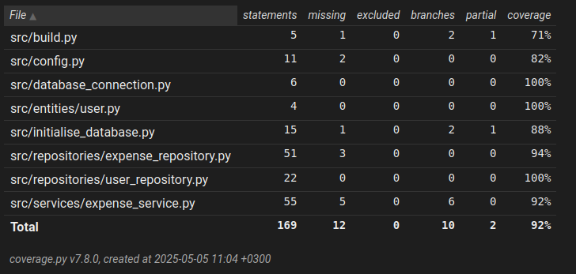

# Testausdokumentti

## Yksikkö- ja integraatiotestaus

Sovellusta on yksikkö- ja integraatiotestattu automatisoidusti unittest-kirjaston avulla.

`TestExpenseService`-luokka testaa sovelluslogiikasta vastaavaa `ExpenseService`-luokkaa. [TextExpenseService](https://github.com/n1k1k/ot-harjoitustyo-2025/blob/main/src/tests/test_expense_service.py) -luokalle injektoidaan instanssit `ExpenseRepository` ja `UserRepository`-luokista.

Tiedon pysyväistallennuksesta vastaavia `ExpenseRepository` ja `UserRepository` - luokkia testataan [TestExpenseService](https://github.com/n1k1k/ot-harjoitustyo-2025/blob/main/src/tests/test_expense_repository.py) ja [TestUserRepository](https://github.com/n1k1k/ot-harjoitustyo-2025/blob/main/src/tests/test_user_repository.py) -luokilla. Testauksessa on käytössä eri tiedosto, kuin sovelluksen käytössä on muuton. Testaustiedostojen nimet on konfiguroitu .env.test tiedostoon seuraavast:

```
DATABASE_FILENAME=database_test.sqlite
EXPENSES_FILENAME=expenses_test.csv
```

### Testien haarautumakattavuus 

Testien haarautumakattavuus on 86%. Haarautumakattavuuden ulkopuolelle on jätetty käyttöliittymä. 



## Järjestelmätestaus

Sovellusta on testattu järjestelmätasolla manuaalisesti Linux-ympätistössä. 

### Sovelluksen toiminnallisuus

Kaikki sovelluksen ominaisuudet, jotka on listattu käyttöohjeessa ja vaatimusmäärittely-dokumentissa on testattu manuaalisesti. Toiminnallisuuksien testauksen yhteydessä on myös kokeiltu syöttää virheellisiä arvoja tai jättää syötekentät tyhjiksi virheiden käsittelyn varmistamiseksi.
