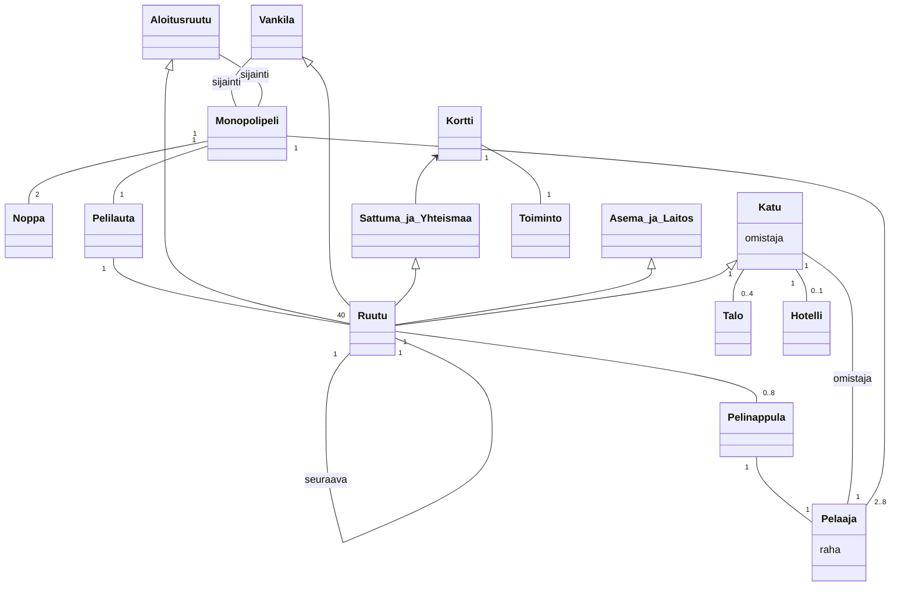

```mermaid
 classDiagram
    Monopolipeli "1" -- "2" Noppa
    Monopolipeli "1" -- "1" Pelilauta
    Pelilauta "1" -- "40" Ruutu
    Ruutu "1" -- "1" Ruutu : seuraava
    Ruutu "1" -- "0..8" Pelinappula
    Pelinappula "1" -- "1" Pelaaja
    Pelaaja "2..8" -- "1" Monopolipeli

    Aloitusruutu <|-- Ruutu
    Vankila <|--Ruutu
    Sattuma_ja_Yhteismaa <|-- Ruutu
    Kortti <-- Sattuma_ja_Yhteismaa
    Asema_ja_Laitos <|-- Ruutu
    Katu <|-- Ruutu

    class Katu{
        omistaja
    }

    Vankila -- Monopolipeli : sijainti
    Aloitusruutu -- Monopolipeli: sijainti
    Kortti "1" -- "1" Toiminto
    Katu "1" -- "1" Pelaaja : omistaja
    Katu "1" -- "0..4" Talo
    Katu "1" -- "0..1" Hotelli

    class Pelaaja{
        raha
    }
```