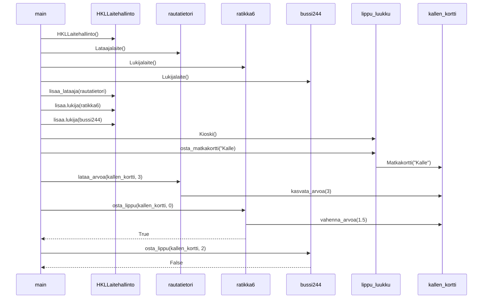

```mermaid
sequenceDiagram
    main->>HKLLaitehallinto: HKLLaitehallinto()
    main->>rautatietori: Lataajalaite()
    main->>ratikka6: Lukijalaite()
    main->>bussi244: Lukijalaite()
    
    main->>HKLLaitehallinto: lisaa_lataaja(rautatietori)
    main->>HKLLaitehallinto: lisaa.lukija(ratikka6)
    main->>HKLLaitehallinto: lisaa.lukija(bussi244)
    
    main->>lippu_luukku: Kioski()
    main ->> lippu_luukku: osta_matkakortti("Kalle)
    lippu_luukku->> kallen_kortti: Matkakortti("Kalle")
    main->>rautatietori: lataa_arvoa(kallen_kortti, 3)
    rautatietori ->> kallen_kortti: kasvata_arvoa(3)
    
    
    main->>ratikka6: osta_lippu(kallen_kortti, 0)
    ratikka6->>kallen_kortti: vahenna_arvoa(1.5)
    ratikka6-->>main: True
    
    main->>bussi244: osta_lippu(kallen_kortti, 2)
    bussi244-->>main: False
```